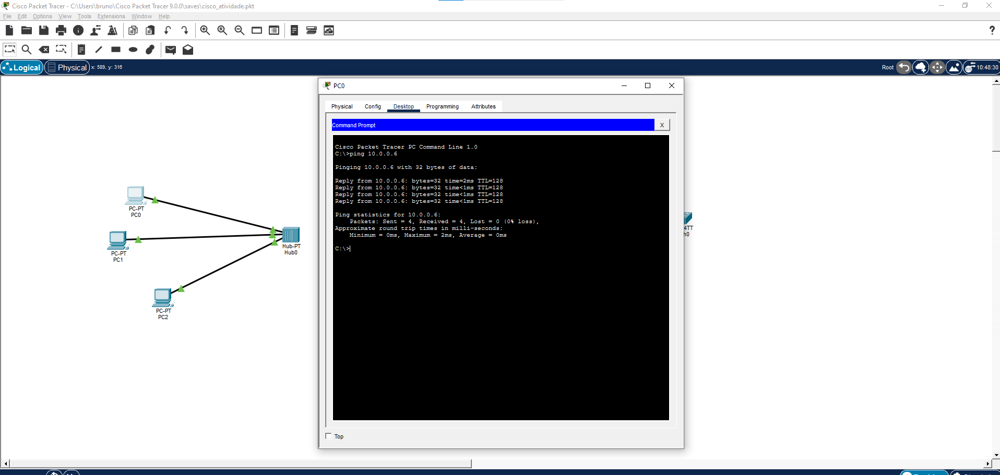
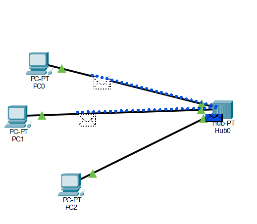
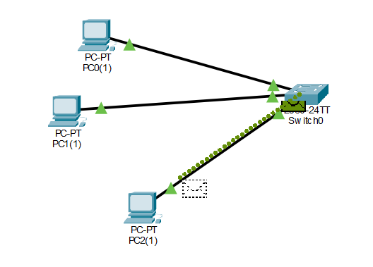

# Cisco-networking-ponderada

VIDEO: https://drive.google.com/file/d/19WR2b2aIorA38z8s5rhR6SrdC1WzJWGs/view?usp=sharing

Relatório Técnico — Análise de Propagação de Sinal em Redes Ethernet
Introdução

Este experimento teve como objetivo analisar o comportamento da transmissão de dados em redes locais utilizando dois dispositivos diferentes: hub e switch. A análise foi realizada no Cisco Packet Tracer utilizando três computadores conectados por cabos de par trançado. No primeiro cenário foi utilizada uma rede com hub, permitindo observar o comportamento do meio compartilhado na camada física. No segundo cenário, o hub foi substituído por um switch 2960, possibilitando a comparação do fluxo de transmissão dos sinais e da propagação das PDUs na rede.

------------------------------------------------------------------------------------------------------------------------------------------------------------------------------------------------------------------------

*Rede com HUB e análise de propagação do sinal*

"Na rede, um hub é um dispositivo que vincula vários computadores e dispositivos. Os hubs também podem ser chamados de repetidores ou concentradores e servem como centro de uma rede local (LAN).Em um hub, cada dispositivo conectado está na mesma sub -rede e recebe todos os dados enviados ao hub." Lenovo

Na primeira etapa do experimento foi criado um cenário de rede no Cisco Packet Tracer com o objetivo de analisar a propagação de sinais em um ambiente baseado em hub. A topologia foi composta por três computadores (PC0, PC1 e PC2) conectados a um hub, utilizando cabos de par trançado (Ethernet copper straight-through) como meio físico de comunicação.

Cada computador foi conectado a uma porta do hub, formando uma topologia física simples em que todos os dispositivos compartilham o mesmo equipamento de interconexão. Após a montagem da rede, foram configurados manualmente os endereços IP em cada máquina, mantendo todos os dispositivos na mesma rede lógica.

PC0: 10.0.0.5
PC1: 10.0.0.6
PC2: 10.0.0.7

Todos os dispositivos utilizaram a máscara de rede 255.0.0.0, garantindo que os três computadores estivessem dentro do mesmo segmento de rede.

Após a configuração dos dispositivos, foram realizados testes de conectividade utilizando o comando ping entre todos os computadores, com o objetivo de verificar se a comunicação estava funcionando corretamente. 

Em seguida, foi enviada uma Simple PDU do PC0 para o PC2 no modo de simulação do Packet Tracer, permitindo observar o comportamento da propagação do sinal e do quadro Ethernet dentro do hub.

*Rede com SWITCH*

"Um switch de rede conecta dispositivos dentro de uma rede (geralmente uma rede local ou LAN*) e encaminha pacotes de dados de e para esses dispositivos. Ao contrário de um roteador, um switch só envia dados para o único dispositivo ao qual se destina (que pode ser outro switch, um roteador ou o computador de um usuário), não para redes de vários dispositivos."

Na segunda etapa do experimento foi criado um cenário semelhante no Cisco Packet Tracer, porém substituindo o hub por um switch. A topologia permaneceu a mesma, com três computadores (PC0, PC1 e PC2) conectados ao dispositivo de rede utilizando cabos de par trançado (Ethernet copper straight-through) como meio físico de comunicação.

Cada computador foi conectado a uma porta do switch, mantendo a mesma estrutura física utilizada no cenário anterior. Após a montagem da rede, foram mantidas as mesmas configurações de endereçamento IP em cada máquina, garantindo que todos os dispositivos permanecessem no mesmo segmento de rede.

PC0: 10.0.0.5
PC1: 10.0.0.6
PC2: 10.0.0.7

Todos os dispositivos utilizaram a máscara de rede 255.0.0.0, assim como no cenário anterior.

Após a configuração, foram realizados novamente testes de conectividade utilizando o comando ping entre os computadores, seguidos do envio de uma Simple PDU do PC0 para o PC2 no modo de simulação do Packet Tracer. Esse procedimento permitiu observar o comportamento da transmissão dos quadros Ethernet utilizando um switch como dispositivo de interconexão.

*Análise de propagação do sinal e comparação física*

Como o hub opera na camada física do modelo OSI, ele apenas repete o sinal elétrica recebido para todas as portas. Então todos os dispositivos recebem o mesmo sinal elétrico ao mesmo tempo, independentemente de serem o destino da comunicação. Porém apenas o dispositivo cujo endereço MAC corresponde ao destino processa o sinal enquanto o resto o descarta. Este modelo possui uma falha relacionado a sua limitação de apenas operar na camada física. Como ele possui um único domínio de colisão, no qual múltiplos dispositivos disputam o mesmo canal de comunicação, se dois dispositivos transmitirem ao mesmo tempo, ocorre uma colisão de sinais, exigindo retransmissão dos dados e podendo reduzir o desempenho da rede.

Podemos comparar isso ao Switch. O switch opera na camada de enlace de dados (camada 2) do modelo OSI e consegue analisar o endereço MAC de destino presente no quadro Ethernet antes de encaminhar os dados. Diferente do hub, o switch não replica automaticamente o sinal elétrico para todas as portas. Ele verifica o destino da comunicação e encaminha o quadro apenas para a porta onde está conectado o dispositivo correspondente. Dessa forma, apenas o destinatário recebe o quadro, enquanto os outros dispositivos da rede não recebem essa transmissão.

O switch não elimina completamente o meio físico, pois todos os dispositivos ainda estão conectados por cabos à mesma infraestrutura de rede. No entanto, ele segmenta a comunicação, criando domínios de colisão separados em cada porta.

REFERENCIAS:
https://www.lenovo.com/br/pt/glossary/what-is-a-hub/?orgRef=https%253A%252F%252Fwww.google.com%252F&srsltid=AfmBOora6b6G9ZOPO4UxH4yGKRxv0xCtl3O4Iyoos-Wy3ZQLLOltjAcf

https://www.cloudflare.com/pt-br/learning/network-layer/what-is-a-network-switch/
